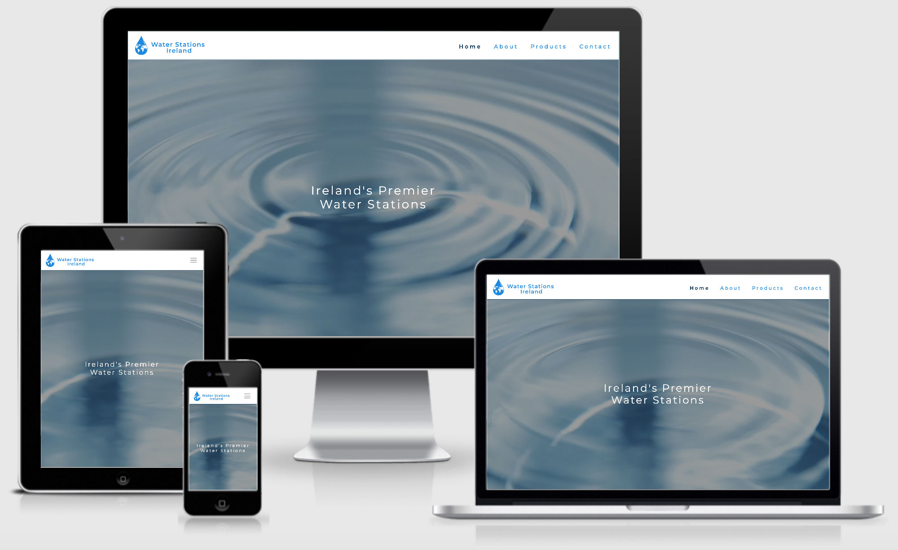
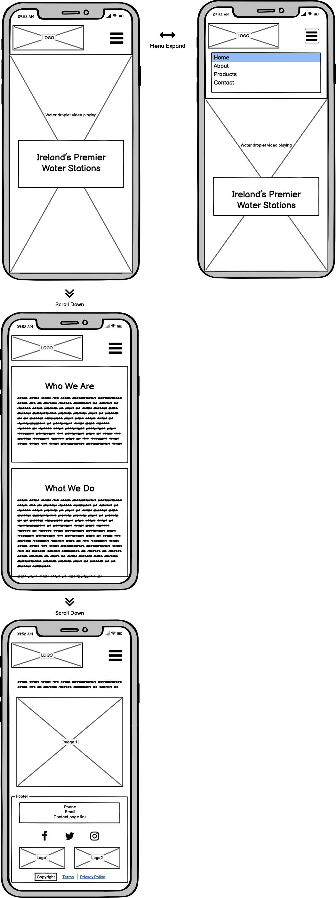
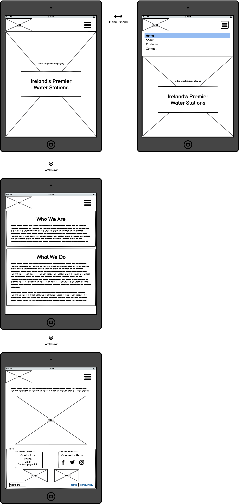
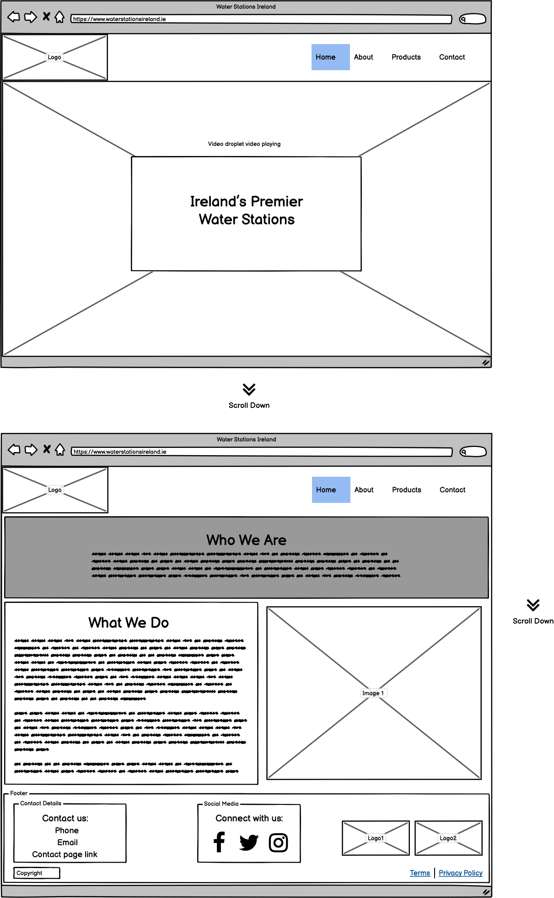
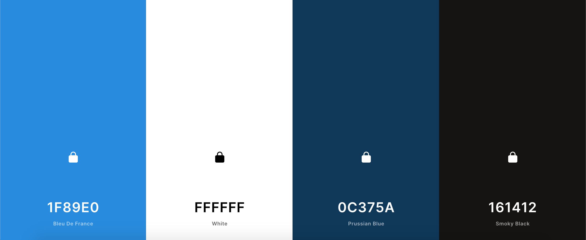

 # 
**MS1: Water Stations Ireland**

 ### View the live project [here.]()

This website has been created as my submission for Milestone Project 1 
for the Code Institute. It is for the Irish company ***Water Stations Ireland***. 
The company are looking to create an online presence for their business
and to increase the sales of their water stations. The website is designed to be 
both accessible and responsive on a range of devices in order to create 
navigation ease for potential customers looking to find more information about
the company and/or to enquire about their products.

---

## Contents
- [**User Experience (UX)**](#ux)
    - [Strategy](#strategy)
        - [User Stories](#user-stories)
        - [Target Audience](#target-audience)
        - [Site Owner Goals](#site-owner-goals)
    - [Scope](#scope)
    - [Structure](#structure)
        - [Home Page](#home-page)
        - [About Page](#about-page)
        - [Products Page](#products-page)
        - [Contact Page](#contact-page)
        - [Navigation Bar](#navigation-bar)
        - [Footer](#footer)
        - [Links](#links)
    - [Skeleton](#skeleton)
    - [Surface](#surface)
        - [Design](#design)
        - [Colour](#colour)
        - [Typography](#typography)
        - [Images](#images)
        - [Final Design Differences](#final-design-differences)
 - [**Features**](#features)
    - [Exisiting Features](#existing-features)
    - [Current Limitations](#current-limitations)
    - [Features Left to Implement](#features-left-to-implement)
 - [**Technologies Used**](#technologies-used)
    - [Languages](#languages)
    - [Technologies](#technologies)
 - [**Testing**](#testing)
    - [User Testing](#user-testing)
    - [Known Bugs](#known-bugs)
 - [**Deployment**](#deployment)
 - [**Credits**](#credits)
    - [Content](#content)
    - [Media](#media)
    - [Acknowledgements](#acknowledgements)

---

## 
**UX**

### **Strategy**
#### User Stories
- As a potential customer, I want to learn about the company, their values and their goals. 
- As a potential customer, I want to find detailed descriptions and clear images of the Water Stations the company offers. 
- As a potential customer, I want to easily be able to contact the company for further information.
- As a potential customer, I want to easily navigate through the website.
- As a potential customer, I want the website to be responsive on whichever device I’m viewing it on.
- As a potential customer, I want to explore a clean and professional website. 

#### Target Audience
The target audience for this website would be potential customers looking to 
enquire about and purchase sustainable Water Stations. Potential customers would 
include Local Authorities, Government Bodies, Business Owners, Schools/Universities. 

#### Site Owner Goals
- Establish an online presence for ***Water Stations Ireland***.
- Increase direct enquiries and purchases through the website.
- Have a functional and responsive website with a clean and professional look.
- Inform site visitors about who ***Water Stations Ireland*** are and what they do.
- Provide information on the sustainability of the company and products. 
- Provide detailed information about the Water Stations on offer and the different options and features available.
- Showcase images of the Water Stations.
- Keep product prices off the site to encourage potential customers to contact the company for a quote.
- Provide a simple means for potential customers to make enquiries.

### **Scope**
- Information section about the company and their ethos must be provided.
- Images of the Water Stations must be displayed, accompanied by detailed descriptions of the different options offered.
- A clear means of contacting the company must be provided via a contact form and a display of the company’s phone, email and social media accounts. 
- The company wants their logo on display and so it will remain fixed to the top of the page consistently across the site.
- Being a member of *Guaranteed Irish* is an important selling-point for the company and so that logo will be on display in the footer consistently across the site.
- A fixed navigation menu must be included to always allow users to make their way through the site easily.
- The site must showcase the professionalism of the company and so it must have a clean and modern layout and design. 
- The site must be visually consistent to make users comfortable.
- The site must be responsive across different devices. 
- A map showcasing where Water Stations have already been purchased and installed will be left as a feature to be implemented and so will **not** be included in this release.
- A gallery page showcasing images of the differed types of Water Stations available will be left as a feature to be implemented and so will **not** be included in this release.
- The company's *Terms* and *Privacy Policy* (available as external links) will be left as features to be implemented and so will **not** be included in this release.

### **Structure**
The website will consist of four separate and structured pages; *Home*, *About*, 
*Products* and *Contact*. Each page will be consistent in terms of layout and design
so that the user is comfortable. The same navigation menu and footer will be 
present across all pages to allow for navigation ease. Three of the four pages
will contain the same hero image. The *Home* page will differ slightly and will
have a hero video rather than image with the company slogan *“Ireland’s Premier
Water Stations”* displayed on top. All of this will apply to the site across 
all devices. 

#### Home Page
- Will contain an introduction telling the user who the company is and what it is that they do. 
- Will contain an image of a Water Station so the user can become familiar with their appearance immediately.
- Important to introduce the purpose straight away so that a user knows immediately what to expect from the site.

#### About Page
- Will contain information about the company’s values and goals.
- Will contain information about the sustainability of the company and its products.
- Important to have this information clear on the site so that a potential customer knows if the company’s ethos aligns with their own. 

#### Products Page
- Will contain detailed information about the different Water Stations available and the different options they offer.
- Will contain different images of the Water Stations.
- Important to include this so that a potential customer can see real-life images of the products they’re interested in and clear information about what is included with each type of Water Station.

#### Contact Page
- Will contain the company’s phone number, email, address and social media links.
- Will contain a form for users to fill out with fields for Name, Email, Phone Number, and a Submit button.
- All form fields will be required.
- Users will be alerted if any of the required fields are left blank or filled out incorrectly.

#### Navigation Bar
- Will remain fixed to the top of each page for consistency across all pages and devices
- It will take on a hamburger menu style on smaller devices for a cleaner appearance. 
- Will contain clear names of each site page for navigation ease.

#### Footer
- Will remain fixed at the bottom of each page for consistency across all pages and devices. 
- Will contain the company’s contact information; phone and email, as well as a link to the contact form on the *Contact Page*. 
- Will contain links to the company’s social media accounts; Twitter, Facebook and Instagram, in the form of the appropriate icons. 
- Will contain two logos as requested by the company; their own and *Guaranteed Irish*. 

#### Links
- All links will change colour when hovered over to make it clear to the user that they are links.
- External links, i.e. to social media accounts, will open in a new tab so that users will not have to leave the site. 
- Internal links will all work and lead the user to the correct place within the site. 
- The company logo will also act as a link to the *Home Page*. 

### **Skeleton**
All wireframes were created using [Balsamiq](https://balsamiq.com/). 
#### Mobile; Home Page

#### Tablet; Home Page

#### Desktop; Home Page 

Please find full PDF versions of all wireframes and sketches below:
- [Mobile Wireframes](documentation/wireframes/mobile)
- [Tablet Wireframes](documentation/wireframes/tablet)
- [Desktop Wireframes](documentation/wireframes/desktop)
- [Initial Mobile Sketch](documentation/sketches/mobile-mockup-sketch.pdf)
- [Initial Tablet Sketch](documentation/sketches/tablet-mockup-sketch.pdf)
- [Initial Desktop Sketch](documentation/sketches/desktop-mockup-sketch.pdf)

### **Surface**
#### Design
The overall design for the site will be clean and simple, allowing users 
to discover the information they need without being distracted by flashy 
colours or imagery. It’s important that a professional feel is portrayed 
by maintaining consistency in the design throughout. Water plays a large 
role in the design which helps to create a clear and flowing site.

#### Colour
I was provided with the main colour the company use for their logo; #1F89E0. 
I used this as my base to build a colour scheme using [Coolors.co](https://coolors.co/) 
as seen below. As the company wanted a professional and clean look for the site I 
chose to keep the scheme simple, nothing too bold to distract the eye. I 
also felt it was appropriate to stick to blue tones to represent water which 
is, of course, the main element at play for this company. This video on the 
*Home Page* was also chosen for this reason, the colours work well with the 
overall crisp tone of the site. 
- #1F89E0 Bleu de France
- #FFFFFF White
- #0C375A Prussian Blue
- #161412 Smoky Black

It was important to ensure legibility of the text on the background it would be 
displayed on so I also used *Contrast Checker* on [Coolors.co](https://coolors.co/) to ensure there would 
be no issues with my chosen palette. 

#### Typography
The company use the font Montserrat in their brochures and logos and so I decided 
to keep this as the font for the headings and navigation menu for consistency. I 
opted for Raleway as the secondary font for the main content on the site as the 
two fonts work well together to create a sleek and modern look. 

#### Images
For the landing page, I used a video of a water droplet from [Coverr.co](https://coverr.co/). I chose a 
video, and this one in particular, as I wanted the landing page to have some 
fluidity. The simple water drop helps to set the tone of the site while acting as 
the backdrop to the company’s slogan, *"Ireland’s Premier Water Stations"*. 

For the remaining three pages the video is replaced by a hero image. I felt the video would be too repetitive if added 
across all pages and so I chose an image instead. The same opaque overlay and title 
format used however, keeps the design consistency flowing.

#### Final Design Differences
Instead of using the same hero image across *Home, About* and *Product Pages*, I ultimately opted for three different images;
one for each page. This would help to differentiate the pages; separating them and further representing that each page covers 
something different. I did however, want to maintain a consistent design in order to keep the user comfortable and so I chose 
three images from a photo series by the same photographer. In doing this there is a nice design flow throughout the site with all 
the images leading on to each other. Each of the images contains the same opaque overlay and heading style as the video from the 
*Home Page*; reinforcing design continuity.

---

## 
**Features**

### **Existing Features**
- #### Navigation Menu
    -
- #### Footer
    -
- #### Social Media Links
    -
- #### Contact Form
    -
    

### **Current Limitations**
- As there is no JavaScript in this release, the contact form on the *Contact Page* will not store any data. 

### **Features Left to Implement**
- #### Map
    - An interactive map which allows users to see where Water Stations are already installed and in-use. This would benefit prospective customers 
    as they could easily locate and, if desired, visit these locations; allowing them to view the product in person. The map could also be
    benefical to users looking for places they can refill their own water bottles. 

- #### Gallery Page
    - A full *Gallery Page* which allows users to see a range of images of the different options of Water Stations available, 
    including images of where these stations are currently installed. Again this would be of benefit to potential customers 
    allowing them to see a full range of products on offer.

- #### *Terms* and *Privacy Policy* 
    - The company has not yet finalised the documentation for their *Terms* and *Privacy Policy*. At a later date they will be 
    accessed on the website via links in the footer. In this release, these links are empty and, if clicked, will keep the 
    user on the current page. 

---

## 
**Technologies Used**

### **Languages**
- HTML5
- CSS3
### **Technologies**
- [Adobe Illustrator](https://www.adobe.com/ie/products/illustrator.html) - used to create the company logos.
- [Adobe Photoshop](https://www.adobe.com/ie/products/photoshop.html) - used to edit and resize all images for web.
- [Balsamiq](https://balsamiq.com/) - used to create wireframes.
- [Bootstrap](https://getbootstrap.com/)  - used throughout the website for responsive layouts across devices and various styling. 
- [Coolors](https://coolors.co/) - used to choose colour scheme and for contrast-checking of chosen colours.
- [Font Awesome](https://fontawesome.com/) - used icons to create social media links.
- [Git](https://git-scm.com/) - version control software used to commit and push code to GitHub.
- [GitHub](https://github.com/) - hosting site used to store the source code of the site with [GitHub Pages](https://pages.github.com/)
used to deploy the live site.
- [Google Chrome DevTools](https://developers.google.com/web/tools/chrome-devtools) - used for inspecting various page elements and identifying any layout issues/bugs. 
- [Google Fonts](https://fonts.google.com/specimen/Raleway?query=rale) - selected Raleway font.
- [Techsini Mockup Generator](http://techsini.com/multi-mockup/index.php) - used to create the multi-device image found at the top of this README.

---

## 
**Testing**

### **User Testing**
-

### **Known Bugs**
-

---

## 
**Deployment**

### **GitHib Pages**
-
-
-

---

## 
**Credits**

### **Content**
- All written content contained on the site was either provided by ***Water Stations Ireland*** or written by me in collaboration with the company.
- Code for hero images was taken and adapted from [w3schools.com](https://www.w3schools.com/howto/howto_css_hero_image.asp).
- Code for hero video was taken and adapted from [w3schools.com](https://www.w3schools.com/howto/howto_css_fullscreen_video.asp) and [css-tricks.com](https://css-tricks.com/full-page-background-video-styles/).

### **Media**
- Water Droplet video on *Home Page* can be found at [Coverr.co](https://coverr.co/videos/slow-motion-water-drop-WGvpkodDWH).
- Plastic bottle image on *About Page* by Brian Yurasits on [Unsplash](https://unsplash.com/photos/Lvs1F46S8Rs).
- Hero images on *About, Products* and *Contact Pages* by Elias Maurer on [Unsplash](https://unsplash.com/@snowidesignz).
- ***Water Stations Ireland*** logos were created by me in collaboration with the company.
- All other images were provided by ***Water Stations Ireland***. I was granted full permission for use. 

### **Acknowledgements**
-

