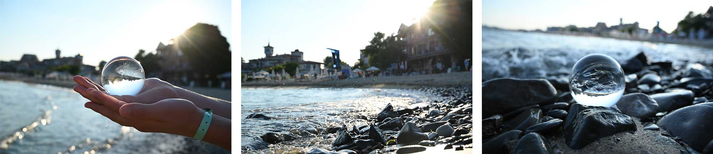
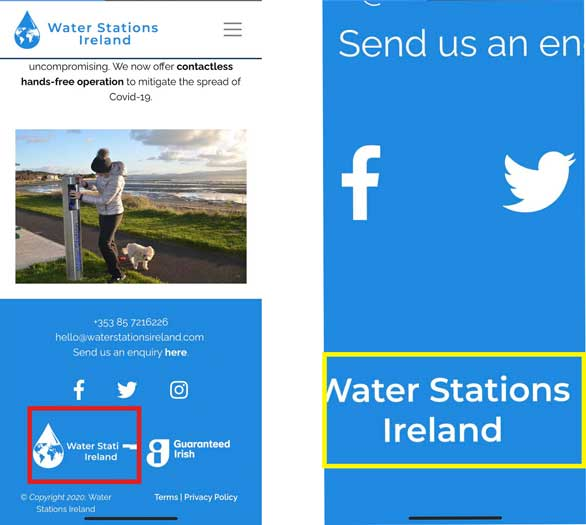

 # 
**MS1: Water Stations Ireland**

 ### View the live project [here.](https://loftusn13.github.io/ms1-waterstationsireland/)

This website has been created as my submission for Milestone Project 1 
for the Code Institute. It is for the Irish company ***Water Stations Ireland***. 
The company are looking to create an online presence for their business
and to increase the sales of their water stations. The website is designed to be 
both accessible and responsive on a range of devices in order to create 
navigation ease for potential customers looking to find more information about
the company and/or to enquire about their products.

---

## Contents
- [**User Experience (UX)**](#ux)
    - [Strategy](#strategy)
        - [User Stories](#user-stories)
        - [Target Audience](#target-audience)
        - [Site Owner Goals](#site-owner-goals)
    - [Scope](#scope)
    - [Structure](#structure)
        - [Home Page](#home-page)
        - [About Page](#about-page)
        - [Products Page](#products-page)
        - [Contact Page](#contact-page)
        - [Navigation Bar](#navigation-bar)
        - [Footer](#footer)
        - [Links](#links)
    - [Skeleton](#skeleton)
    - [Surface](#surface)
        - [Design](#design)
        - [Colour](#colour)
        - [Typography](#typography)
        - [Images](#images)
        - [Final Design Differences](#final-design-differences)
 - [**Features**](#features)
    - [Exisiting Features](#existing-features)
    - [Current Limitations](#current-limitations)
    - [Features Left to Implement](#features-left-to-implement)
 - [**Technologies Used**](#technologies-used)
    - [Languages](#languages)
    - [Technologies](#technologies)
 - [**Testing**](#testing)
    - [Testing User Stories](#testing-user-stories)
    - [Known Bugs](#known-bugs)
 - [**Deployment**](#deployment)
    - [GitHub Pages](#github-pages)
    - [Run Locally](#run-locally)
 - [**Credits**](#credits)
    - [Content](#content)
    - [Media](#media)
    - [Acknowledgements](#acknowledgements)

---

## 
**UX**

### **Strategy**
#### User Stories
- As a potential customer, I want to learn about the company, their values and their goals. 
- As a potential customer, I want to find detailed descriptions and clear images of the Water Stations the company offers. 
- As a potential customer, I want to easily be able to contact the company for further information.
- As a potential customer, I want to easily navigate through the website.
- As a potential customer, I want the website to be responsive on whichever device I’m viewing it on.
- As a potential customer, I want to explore a clean and professional website. 

#### Target Audience
The target audience for this website would be potential customers looking to 
enquire about and purchase sustainable Water Stations. Potential customers would 
include Local Authorities, Government Bodies, Business Owners, Schools/Universities. 

#### Site Owner Goals
- Establish an online presence for ***Water Stations Ireland***.
- Increase direct enquiries and purchases through the website.
- Have a functional and responsive website with a clean and professional look.
- Inform site visitors about who ***Water Stations Ireland*** are and what they do.
- Provide information on the sustainability of the company and products. 
- Provide detailed information about the Water Stations on offer and the different options and features available.
- Showcase images of the Water Stations.
- Keep product prices off the site to encourage potential customers to contact the company for a quote.
- Provide a simple means for potential customers to make enquiries.

### **Scope**
- Information section about the company and their ethos must be provided.
- Images of the Water Stations must be displayed, accompanied by detailed descriptions of the different options offered.
- A clear means of contacting the company must be provided via a contact form and a display of the company’s phone, email and social media accounts. 
- The company wants their logo on display and so it will remain fixed to the top of the page consistently across the site.
- Being a member of *Guaranteed Irish* is an important selling-point for the company and so that logo will be on display in the footer consistently across the site.
- A fixed navigation menu must be included to always allow users to make their way through the site easily.
- The site must showcase the professionalism of the company and so it must have a clean and modern layout and design. 
- The site must be visually consistent to make users comfortable.
- The site must be responsive across different devices. 
- A map showcasing where Water Stations have already been purchased and installed will be left as a feature to be implemented and so will **not** be included in this release.
- A gallery page showcasing images of the differed types of Water Stations available will be left as a feature to be implemented and so will **not** be included in this release.
- The company's *Terms* and *Privacy Policy* (available as external links) will be left as features to be implemented and so will **not** be included in this release.

### **Structure**
The website will consist of four separate and structured pages; *Home*, *About*, 
*Products* and *Contact*. Each page will be consistent in terms of layout and design
so that the user is comfortable. The same navigation menu and footer will be 
present across all pages to allow for navigation ease. Three of the four pages
will contain the same hero image. The *Home* page will differ slightly and will
have a hero video rather than image with the company slogan *“Ireland’s Premier
Water Stations”* displayed on top. All of this will apply to the site across 
all devices. 

#### Home Page
- Will contain an introduction telling the user who the company is and what it is that they do. 
- Will contain an image of a Water Station so the user can become familiar with their appearance immediately.
- Important to introduce the purpose straight away so that a user knows immediately what to expect from the site.

#### About Page
- Will contain information about the company’s values and goals.
- Will contain information about the sustainability of the company and its products.
- Important to have this information clear on the site so that a potential customer knows if the company’s ethos aligns with their own. 

#### Products Page
- Will contain detailed information about the different Water Stations available and the different options they offer.
- Will contain different images of the Water Stations.
- Important to include this so that a potential customer can see real-life images of the products they’re interested in and clear information about what is included with each type of Water Station.

#### Contact Page
- Will contain the company’s phone number, email, address and social media links.
- Will contain a form for users to fill out with fields for Name, Phone Number, Email, Message and a Submit button.
- All form fields will be required.
- Users will be alerted if any of the required fields are left blank or filled out incorrectly.

#### Navigation Bar
- Will remain fixed to the top of each page for consistency across all pages and devices
- It will take on a hamburger menu style on smaller devices for a cleaner appearance. 
- Will contain clear names of each site page for navigation ease.

#### Footer
- Will remain fixed at the bottom of each page for consistency across all pages and devices. 
- Will contain the company’s contact information; phone and email, as well as a link to the contact form on the *Contact Page*. 
- Will contain links to the company’s social media accounts; Twitter, Facebook and Instagram, in the form of the appropriate icons. 
- Will contain two logos as requested by the company; their own and *Guaranteed Irish*. 

#### Links
- All links will change colour when hovered over to make it clear to the user that they are links.
- External links, i.e. to social media accounts, will open in a new tab so that users will not have to leave the site. 
- Internal links will all work and lead the user to the correct place within the site. 
- The company logo will also act as a link to the *Home Page*. 

### **Skeleton**
All wireframes were created using [Balsamiq](https://balsamiq.com/). 
#### Mobile; Home Page

#### Tablet; Home Page

#### Desktop; Home Page 

Please find full PDF versions of all wireframes and sketches below:
- [Mobile Wireframes](documentation/wireframes/mobile)
- [Tablet Wireframes](documentation/wireframes/tablet)
- [Desktop Wireframes](documentation/wireframes/desktop)
- [Initial Mobile Sketch](documentation/sketches/mobile-mockup-sketch.pdf)
- [Initial Tablet Sketch](documentation/sketches/tablet-mockup-sketch.pdf)
- [Initial Desktop Sketch](documentation/sketches/desktop-mockup-sketch.pdf)

### **Surface**
#### Design
The overall design for the site will be clean and simple, allowing users 
to discover the information they need without being distracted by flashy 
colours or imagery. It’s important that a professional feel is portrayed 
by maintaining consistency in the design throughout. Water plays a large 
role in the design which helps to create a clear and flowing site.

#### Colour
I was provided with the main colour the company use for their logo; #1F89E0. 
I used this as my base to build a colour scheme using [Coolors.co](https://coolors.co/) 
as seen below. As the company wanted a professional and clean look for the site I 
chose to keep the scheme simple, nothing too bold to distract the eye. I 
also felt it was appropriate to stick to blue tones to represent water which 
is, of course, the main element at play for this company. This video on the 
*Home Page* was also chosen for this reason, the colours work well with the 
overall crisp tone of the site. 
- #1F89E0 Bleu de France
- #FFFFFF White
- #0C375A Prussian Blue
- #161412 Smoky Black

It was important to ensure legibility of the text on the background it would be 
displayed on so I also used *Contrast Checker* on [Coolors.co](https://coolors.co/) to ensure there would 
be no issues with my chosen palette. 

#### Typography
The company use the font Montserrat in their brochures and logos and so I decided 
to keep this as the font for the headings and navigation menu for consistency. I 
opted for Raleway as the secondary font for the main content on the site as the 
two fonts work well together to create a sleek and modern look. 

#### Images
For the landing page, I used a video of a water droplet from [Coverr.co](https://coverr.co/). I chose a 
video, and this one in particular, as I wanted the landing page to have some 
fluidity. The simple water drop helps to set the tone of the site while acting as 
the backdrop to the company’s slogan, *"Ireland’s Premier Water Stations"*. 

For the remaining three pages the video is replaced by a hero image. I felt the video would be too repetitive if added 
across all pages and so I chose an image instead. The same opaque overlay and title 
format used however, keeps the design consistency flowing.

#### Final Design Differences
Instead of using the same hero image across *About, Products* and *Contact Pages*, I ultimately opted for three different images;
one for each page. This would help to differentiate the pages; separating them and further representing that each page covers 
something different. I did however, want to maintain a consistent design in order to keep the user comfortable and so I chose 
three images from a photo series by the same photographer (see [Media Credits](#media)). In doing this there is a nice design flow throughout the site with all 
the images leading on to each other. Each of the images contains the same opaque overlay and heading style as the video from the 
*Home Page*; reinforcing design continuity.

---

## 
**Features**

The website has a clean and visually consistent design throughout and is responsive across devices. Information is separated out through the 
different pages, with each page serving its own purpose. Only information relevant to the company, their ethos and their products is provided 
so as not to overwhelm users with unnecessary content that would distract from the purpose of the site. Every page contains the same footer 
and header.
#### Home Page 
- Contains a muted, looped video which autoplays once a user lands on the page. The video has an opaque overlay with the company slogan on top. 
- Clear and concise information about ***Water Stations Ireland*** and what they do is provided straight away so that users immediately understand what the site is going to be about. 
- A photo of the company's product is provided so that users can become familiar with their appearance and design.
- A link to the *Products Page* is provided giving users the option to skip through the site. 
#### About Page
- Contains a hero image with an opaque overlay. The heading on top gives insight into the kind of information users can expect on the page.
- Clear introduction about the Water Stations and their advantages is provided, allowing users to decide whether this is the kind of product they're looking for.
- Another image of the product is provided to further familiarise users.
- Clear and concise information about the company's mission/ethos is provided so that users know whether their beliefs align.
#### Products Page
- Contains a hero image with an opaque overlay. The heading on top reinforces the company's ethos.
- Clear and relevant technical information about the different products on offer is provided to allow users to gain a firm understanding of what is available.
- Multiple images of the products are provided for each different product option, helping to reinforce the information being supplied.
#### Contact Page
- Contains a hero image with an opaque overlay. The heading on top provides a call to action to contact the company.
- Various means of contact are provided including links to social media accounts, allowing users to choose the method that works best for them.
- A contact form is provided, allowing users to fill in their own contact information and their enquiry.

### **Existing Features** 
- **Header Logo**
    - The ***Water Stations Ireland*** logo contained in the top left of the header exists on every page of the site and on every device, allowing 
    users to become familiar with the company brand. 
    - This logo acts as a link to the *Home Page*, allowing users to always and easily return to the start of the site. 

- **Navigation Bar**
    - The navigation bar is contained in the header and exists on every page of the site and on every device, allowing users to easily navigate 
    through and ensuring that there is no location within the site that they could not return from.
    - It contains clear names of each site page (*Home, About, Products, Contact*) to ensure users know what kind of information to expect; 
    allowing them to quickly find the content they're looking for.
    - On tablet and mobile devices this collapses into a familiar hamburger menu in order to maintain a cleaner design. When clicked, this menu 
    expands to show the list of site pages.   
    - On both full and collapsed menus, the active page is a bolder and darker font, allowing users to easily recognise which page 
    they are on. When other pages are hovered over, the font colour changes, confirming to users that it is a link.  

- **Social Media Links**
    - Three social media links for the company's Facebook, Twitter and Instagram accounts exist in the footer on every page of the site, on every 
    device and also on the *Contact Page*, giving users the option to learn more about the company and/or follow them on social media. 
    - All three links are in the form of the appropriate and familiar social media icons, allowing users to know which platform they can expect to 
    be brought to.
    - In both the footer and the *Contact Page* the links are located below a call-to-action message inviting users to connect with the company. This 
    message is hidden in the footer on mobile devices to maintain a cleaner design.
    - When each icon is hovered over, the colour changes, confirming to users that it is a link.
    - When clicked, all three links open in a new tab ensuring the user does not lose their way back to the site.

- **Copyright**
    - "&copy; *Copyright 2020;* Water Stations Ireland" exists in the footer on every page of the site and on every device, protecting the company's content. 

- **Footer Logos**
    - The ***Water Stations Ireland*** logo exists in the footer on every page of the site and on every device, allowing users to become familiar with the company brand.
    - The *Guaranteed Irish* logo exists in the footer on every page of the site and on every device, reminding users that this is an Irish-owned company, something which 
    is very important to the company.  

- **Contact Information** 
    - The company's phone number and email address exists in the footer on every page of the site and on every device, allowing users to easily contact 
    the company if they wish to do so.
    - The company's phone number, email address and their base locations are located in the *Contact Page* on every device, allowing users to easily contact 
    the company if they wish to do so.
    - The phone number in both the footer and *Contact Page* acts as a link and, when clicked, brings the user to a method of making a call; whether that is their keypad 
    on mobile devices, or an app/method of making phone calls on tablets or desktop. This makes it easier for users to call the company if they wish to do so.
    - In both the footer and *Contact Page* the contact information is located below a call-to-action message inviting users to contact the company. This 
    message is hidden in the footer on mobile devices to maintain a cleaner design.
    - An internal link to the *Contact Page* exists in the footer on every page of the site and on every device. This link is within a call-to-action message inviting users to make an 
    enquiry. When hovered over, the font colour of the link changes, confirming to users that it is a link.

- **Contact Form**
    - A contact form with fields for **Full Name, Phone Number, Email Address, Subject** and a **Submit button** exists on the *Contact Page* on every device. 
    This allows users to contact the company with their question/enquiry and to provide their own contact details for the company to reach out to them with the answer 
    or information requested.
    - Each field has a label ensuring users know what information should be entered.
    - Each field is required and upon clicking the **Submit button**, if any field is left blank, users are alerted to this via a "Please fill out this field"
    message which will appear beneath the empty field. This allows users to easily see and understand why they cannot submit the form.
    - Users are alerted if the **Email Address** field is filled out incorrectly, i.e. wrong format, missing a "." or "@". If incorrect, users are alerted to this 
    via a message which will appear beneath the field explaining what the problem is. This allows users to easily identify and fix the mistake.
    - Users are alerted if the **Phone Number** field is filled out incorrectly, i.e. they have entered letter(s) when only numbers, "-" and "+" are allowed. If 
    incorrect, users are alerted to this via a "Please match the requested format" message which will appear beneath the field. This allows users to easily identify 
    and fix the mistake. 

### **Current Limitations**
- As there is no JavaScript in this release, the contact form on the *Contact Page* does not store any data. 

### **Features Left to Implement**
- #### Map
    - An interactive map which allows users to see where Water Stations are already installed and in-use. This would benefit prospective customers 
    as they could easily locate and, if desired, visit these locations; allowing them to view the product in person. The map could also be
    beneficial to users looking for places they can refill their own water bottles. 

- #### Gallery Page
    - A full *Gallery Page* which allows users to see a range of images of the different options of Water Stations available, 
    including images of where these stations are currently installed. Again, this would be a benefit to potential customers 
    allowing them to see a full range of products on offer. The company does not, at this time, have sufficient images of the 
    products to create such a gallery.

- #### Contact Form
    - Have the entered form data submitted and generated into an email that will be sent to the company.
    - Add a CAPTCHA to the contact form to protect the company from spam.

- #### *Terms* and *Privacy Policy* 
    - The company has not yet finalised the documentation for their *Terms* and *Privacy Policy*. At a later date they will be 
    accessed on the website via links in the footer. In this release, these links are empty and, if clicked, will keep the 
    user on the current page. 

- #### GDPR Compliancy 
    - Implement various features required for the website to fully comply with EU data-protection laws, including but not limited to, 
    adding a cookie notice and adding a checkbox in the contact form that must be ticked by the user to confirm they accept the *Terms*.

---

## 
**Technologies Used**

### **Languages**
- HTML5
- CSS3
### **Technologies**
- [Adobe Illustrator](https://www.adobe.com/ie/products/illustrator.html) - used to create the company logos.
- [Adobe Photoshop](https://www.adobe.com/ie/products/photoshop.html) - used to edit and resize all images for web.
- [Am I Responsive?](http://ami.responsivedesign.is/) - used to create the multi-device image found at the top of this README.
- [Balsamiq](https://balsamiq.com/) - used to create wireframes.
- [Bootstrap](https://getbootstrap.com/)  - used throughout the website for responsive layouts across devices and various styling. 
- [Coolors](https://coolors.co/) - used to choose colour scheme and for contrast-checking of chosen colours.
- [Font Awesome](https://fontawesome.com/) - used icons to create social media links.
- [Git](https://git-scm.com/) - version control software used to commit and push code to GitHub.
- [GitHub](https://github.com/) - hosting site used to store the source code of the site with [GitHub Pages](https://pages.github.com/)
used to deploy the live site.
- [Google Chrome DevTools](https://developers.google.com/web/tools/chrome-devtools) - used for inspecting various page elements and identifying any layout issues/bugs. 
- [Google Fonts](https://fonts.google.com/specimen/Raleway?query=rale) - selected Raleway and Montserrat fonts.

---

## 
**Testing**

For the testing of this website I needed to ensure that it was fully functional and responsive across different browsers, devices and screen sizes. It is essential that users can easily find and see all 
content and images contained on the site without any elements overlapping and becoming illegible. It is important that the overall design, layout and purpose of the site are not compromised when being viewed on 
different devices. 

- **Code Validation**
    - All HTML code on every page was validated through [W3C Markup Validator](https://validator.w3.org/) - no warnings or error reported.
    - All CSS code was validated through [W3C CSS Validator](https://jigsaw.w3.org/css-validator/validator) - no warnings or errors reported.

- **Internal & External Links**
    - I tested every link contained within the website to ensure none were broken and to ensure each one would lead the user to the correct place.
    - Each link on each page works correctly; bringing you to the expected location. 
    - External links on every page open in new tabs, bringing you to the expected location.
    - The exception to this are the *Terms* and *Privacy Policy* links located in the footer on every page; these are not currently operational as explained [**here**](#terms-and-privacy-policy). 

- **Initial Testing**
    - I used [Google Chrome DevTools](https://developers.google.com/web/tools/chrome-devtools) as my initial testing in order to see how well the website responded across different devices.
    - This allowed me to see that some headings and elements, which looked great on mobile, appeared too small on larger screens and so I was able to implement media queries to increase 
    the sizes and adjust the paddings when the screen goes above certain dimensions.

- **Browser Testing**
    - I tested this website across multiple browsers to ensure that all elements continued to function as normal.
        - As the hero video on the *Home Page* is the only active element on the site I needed to ensure that it played as normal across browsers, i.e. that it wouldn't stop playing or require a user to do anything in order to play.
    - **Opera, Mozilla Firefox** and **Microsoft Edge** were each tested on an Apple Macbook Pro.
    - **Amazon Silk** was tested on a Kindle Fire.
    - **Google Chrome** was tested on PCs, Apple Macbooks, multiple mobile devices and tablet devices.
    - **Safari** was tested on Apple Macbooks and various iPhone and iPad models. The following was noted:
        - *Home Page* hero video seems to have the slightest delay in autoplaying on **Safari** but once started, it loops as normal.

- **Device Testing**
    - I tested this website across a variety of devices to ensure responsivity.
    - As mentioned above in **Initial Testing**, I also used [DevTools](https://developers.google.com/web/tools/chrome-devtools), in order to view the site on different screen sizes corresponding to different devices.
    - As I only had a limited option of devices available to me, I reached out to friends, family and the Slack community in order to test a larger sample.
    - Devices the website was tested on include:
        - Amazon - 
            - **Kindle:** Fire.
        - Android mobile - 
            - **Huawei:** P10, P20 Lite, P30 and P30 Lite. 
            - **OnePlus:** 6T, 8 and Nord. 
            - **Samsung:** Galaxy A40 and Galaxy A5.
        - Android tablet - 
            - **Samsung:** Tab A. 
            - **Huawei:**
        - Apple mobile - 
            - **iPhone:** 6, 8, 11 and X.
        - Apple tablet - 
            - **iPad:** 3rd Gen (iOS 9.3.5) and 4th Gen (iOS 10.3.3)
    - From my own testing and from feedback received from others who viewed the website, I found:
        - The site was fully responsive on all tested devices.
        - Design and layout remained consistent and flowing.
        - All written content and images are correctly laid out for optimal reading and viewing.
        - The site is easy and straightforward to navigate through.
    - One friend alerted me to something they noticed on their **iPhone 11** device; details of which can be found in [Known Bugs](#known-bugs) below.

### **Testing User Stories**
- "*As a potential customer, I want to learn about the company, their values and their goals.*"
    

- "*As a potential customer, I want to find detailed descriptions and clear images of the Water Stations the company offers.*"

- "*As a potential customer, I want to easily be able to contact the company for further information.*"

- "*As a potential customer, I want to easily navigate through the website."*

- "*As a potential customer, I want the website to be responsive on whichever device I’m viewing it on.*"

- "*As a potential customer, I want to explore a clean and professional website.*"

### **Known Bugs**
- I was made aware of a slight bug on the **iPhone 11**:
    - As seen in the image below (red highlight), the ***Water Stations Ireland*** logo in the footer has some image distortion on the right; obscuring the last letters of the word 'Station'.  
    - As seen in the image below (yellow highlight), the image corrects itself when you zoom in closer to the footer, but then returns to it's distorted form when you zoom back out. 
    - In an attempt to figure out this bug: 
        - I entered the dimensions of the **iPhone 11** into [DevTools](https://developers.google.com/web/tools/chrome-devtools) but the bug is not visible there.
        - I reached out to two other friends who also have the **iPhone 11** to ensure this was a model bug and not limited to just one device; they confirmed the same bug was present on their phones.
        - I asked them to open the site on both *Safari* and *Google Chrome* browsers to try and rule out if the bug was due to a browser but they reported that the bug is present across both browsers.
    - From my testing across all other devices as mentioned previously, this bug was not found on any other **iPhone** models or devices.
    - Further testing will be required to attempt to solve this bug.

- Another bug presents on the **iPad 3rd Gen.** (iOS 9.3.5):
    - Upon landing on the *Home Page* the hero video does not autoplay. 
    - It appears as though it is a still image and does not start playing at any time.
    - From my testing across all other devices as mentioned previously, this bug was not found on any other device, including the other **iPad** model.

---

## 
**Deployment**

This project used the Code Institute's student [template](https://github.com/Code-Institute-Org/gitpod-full-template). A new repository named **ms1-waterstationsireland**
was created which included all branches from the template. The project was developed using the IDE [GitPod](https://www.gitpod.io/). Version control software [Git](https://git-scm.com/) was used to commit and push the code to 
[GitHub](https://github.com/) where it was stored. The following commands were used for this:
- **git add** ***filename/directory*** - This command adds files/directories to the staging area to be committed.
- **git commit -m** *"message here"* - This command commits files/directories to the repository. Commit messages should clearly explain the update being committed.
- **git push** - This command pushes all committed updates/changes into the GitHub repository.

### **GitHub Pages**
To deploy to [GitHub Pages](https://pages.github.com/) these steps were followed:

- Log into GitHub.
- Navigate to the **Repositories** tab. 
- Choose the desired repository.
- Navigate to the **Settings** tab underneath the repository name.
- Scroll down until you reach the **GitHub Pages** section.
- Under **Source** click on the **None** drop-down menu and choose **master branch**.
- Click **Save** and the page will refresh automatically.
- Scroll back down to the **GitHub Pages** section.
- You'll see *"Your site is published at"* followed by the site link.
- The website has been deployed.

### **Run Locally**
In order to make a clone, follow these steps:

- Log into GitHub.
- Navigate to the **Repositories** tab. 
- Choose the desired repository.
- Above the list of files, click on the **Code** drop-down menu.
- Copy the clone URL under the **HTTPS** tab.
- Open a terminal window in your IDE of choice.
- Change the working directory to whichever location you want the cloned directory to be in.
- Type *git clone* and then paste the URL that you copied earlier.
- Press enter.
- Your local clone has now been created.

---

## 
**Credits**

### **Content**
- All written content contained on the site was either provided by ***Water Stations Ireland*** or written by me in collaboration with the company.
- Code for hero images was taken and adapted from [w3schools.com](https://www.w3schools.com/howto/howto_css_hero_image.asp).
- Code for hero video was taken and adapted from [w3schools.com](https://www.w3schools.com/howto/howto_css_fullscreen_video.asp) and [css-tricks.com](https://css-tricks.com/full-page-background-video-styles/).

### **Media**
- Water Droplet video on *Home Page* can be found at [Coverr.co](https://coverr.co/videos/slow-motion-water-drop-WGvpkodDWH).
- Plastic bottle image on *About Page* by Brian Yurasits on [Unsplash](https://unsplash.com/photos/Lvs1F46S8Rs).
- Hero images on *About, Products* and *Contact Pages* by Elias Maurer on [Unsplash](https://unsplash.com/@snowidesignz).
- ***Water Stations Ireland*** logos were created by me in collaboration with the company.
- All other images were provided by ***Water Stations Ireland***. I was granted full permission for use. 

### **Acknowledgements**
- The company, ***Water Stations Ireland***, for giving me the opportunity to develop their business site and for providing me with any information or images I requested of them.
- My mentor, Spencer Barriball for his helpful feedback and advice for this project.
- The Slack community for any questions they helped me to answer, and feedback they provided. 
- Friends and family who viewed the website on their own devices and provided any feedback where necessary. 
