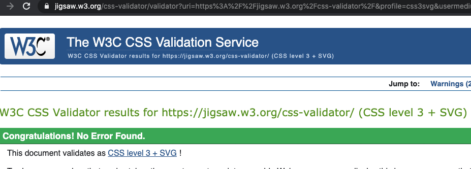
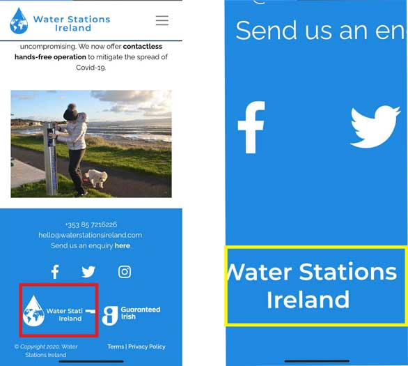

 # 
**MS1: Water Stations Ireland**

 ### View the live project [here.](https://loftusn13.github.io/ms1-waterstationsireland/)
 ### View the main README file [here.](./README.md)

## Contents
- [**Testing**](#testing)
    - [Code Validation](#code-validation)
    - [Initial Testing](#device-testing)
    - [Device Testing](#device-testing)
    - [Browser Testing](#browser-testing)
    - [Testing User Stories](#testing-user-stories)
    - [Known Bugs](#known-bugs)

---

## 
**Testing**

For the testing of this website I needed to ensure that it was fully functional and responsive across different browsers, devices and screen sizes. It is essential that users can easily find and see all 
content and images contained on the site without any elements overlapping and becoming illegible. It is important that the overall design, layout and purpose of the site are not compromised when being viewed on 
different devices. 

### **Code Validation**
- All HTML code on every page was validated through [W3C Markup Validator](https://validator.w3.org/) - no warnings or errors reported.

- All CSS code was validated through [W3C CSS Validator](https://jigsaw.w3.org/css-validator/) - no warnings or errors reported.

### **Internal & External Links**
- I tested every link contained within the website to ensure none were broken and to ensure each one would lead the user to the correct place.
- Each link on each page works correctly; bringing you to the expected location. 
- External links on every page open in new tabs, bringing you to the expected location.
- The exception to this are the *Terms* and *Privacy Policy* links located in the footer on every page; these are not currently operational as explained in the [main README file](./README.md) under **Features Left to Implement**.

### **Initial Testing**
- I used [Google Chrome DevTools](https://developers.google.com/web/tools/chrome-devtools) as my initial testing in order to see how well the website responded across different devices.
- This allowed me to see that some headings and elements, which looked great on mobile, appeared too small on larger screens and so I was able to implement media queries to increase 
    the sizes and adjust the paddings when the screen goes above certain dimensions.

### **Device Testing**
- I tested this website across a variety of devices to ensure responsivity.
- As mentioned above in **Initial Testing**, I also used [DevTools](https://developers.google.com/web/tools/chrome-devtools), in order to view the site on different screen sizes corresponding to different devices.
- As I had a limited option of devices available to me, I reached out to friends, family and the Slack community in order to test a larger sample.
- Devices the website was tested on include:
    - Amazon - 
        - **Kindle:** Fire.
    - Android mobile - 
        - **Huawei:** P10, P20 Lite, P30 and P30 Lite. 
        - **OnePlus:** 6T, 8 and Nord. 
        - **Samsung:** Galaxy A40 and Galaxy A5.
    - Android tablet - 
        - **Samsung:** Galaxy Tab A 10.1" 2018. 
    - Apple mobile - 
        - **iPhone:** 6, 8, 11 and X.
    - Apple tablet - 
        - **iPad:** 3rd Gen (iOS 9.3.5) and 4th Gen (iOS 10.3.3)
- During this testing a bug was found on Apple **iPhone** and **iPad** models where the hero video on the *Home Page* did not play and the opaque overlay and heading were gone, as seen in the image below.
    - Upon researching what would cause this glitch I discovered the following [article](https://developer.apple.com/documentation/webkit/delivering_video_content_for_safari).
    - This allowed me to figure out the issue which was to add the *muted* attribute to the **video element**. 
    - This **solved the bug** on the Apple devices as the video now plays as normal with the opaque overlay and heading in place.  
    - One exception to this can be found in [Known Bugs](#known-bugs).

- During this testing, I was also alerted to something noticed on the **iPhone 11** device; details of which can be found in [Known Bugs](#known-bugs).
- Overall, from my own device testing and from feedback received from others who viewed the website, I found:
    - The site was fully functional and responsive on all tested devices.
    - Design and layout remained consistent and flowing.
    - All written content and images are correctly laid out for optimal reading and viewing.
    - The site is easy and straightforward to navigate through.

### **Browser Testing**
- I tested this website across multiple browsers to ensure that all elements continued to function as normal.
- As the hero video on the *Home Page* is the only active element on the site I needed to ensure that it played as normal across browsers, i.e. that it wouldn't stop playing or require a user to do anything in order to play.
- **Opera, Mozilla Firefox** and **Microsoft Edge** were each tested on an Apple Macbook Pro.
- **Amazon Silk** was tested on a Kindle Fire.
- **Google Chrome** was tested on PCs, Apple Macbooks, multiple mobile devices and tablet devices.
- **Safari** was tested on Apple Macbooks and various iPhone and iPad models. The following was noted:
    - *Home Page* hero video seems to have the slightest delay in autoplaying on **Safari** but once started, it loops as normal.

### **Known Bugs**
- I was made aware of a slight bug on the **iPhone 11**:
    - As seen in the image below (red highlight), the ***Water Stations Ireland*** logo in the footer has some image distortion on the right; obscuring the last letters of the word 'Station'.  
    - As seen in the image below (yellow highlight), the image corrects itself when you zoom in closer to the footer, but then returns to its distorted form when you zoom back out. 
    - In an attempt to figure out this bug: 
        - I entered the dimensions of the **iPhone 11** into [DevTools](https://developers.google.com/web/tools/chrome-devtools) but the bug is not visible there.
        - I reached out to two other friends who also have the **iPhone 11** to ensure this was a model bug and not limited to just one device; they confirmed the same bug was present on their phones.
        - I asked them to open the site on both *Safari* and *Google Chrome* browsers to try and rule out if the bug was due to a browser but they reported that the bug is present across both browsers.
    - From my testing across all other devices as mentioned previously, this bug was not found on any other **iPhone** models or devices.
    - Further testing will be required to attempt to solve this bug.

- Another bug presents on the **iPad 3rd Gen.** (iOS 9.3.5):
    - Upon landing on the *Home Page* the hero video does not autoplay.
    - The opaque overlay and heading are in place but the video appears as though it is a still image and does not play at any time.
    - From my testing across all other devices as mentioned previously, this bug was not found on any other device, including the other **iPad** model.
    - The cause of this bug may be that the model in question is an older one which runs an older iOS system, however further testing will be required to attempt to solve this bug.

### **Testing User Stories**
- "*As a potential customer, I want to learn about the company, their values and their goals.*"
    

- "*As a potential customer, I want to find detailed descriptions and clear images of the Water Stations the company offers.*"

- "*As a potential customer, I want to easily be able to contact the company for further information.*"

- "*As a potential customer, I want to easily navigate through the website."*

- "*As a potential customer, I want the website to be responsive on whichever device I’m viewing it on.*"

- "*As a potential customer, I want to explore a clean and professional website.*"
